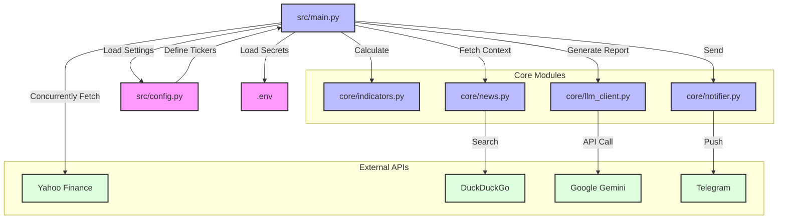
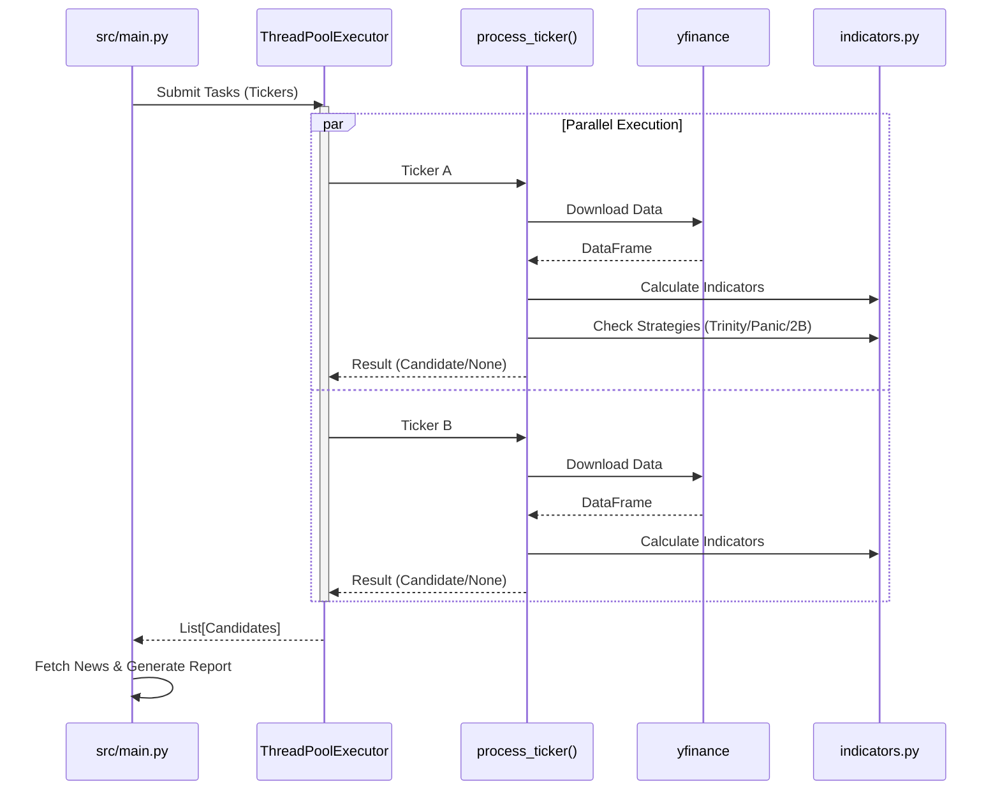

# OpenClaw Financial Intelligence 🦞

**OpenClaw** is a stateless, AI-driven financial intelligence unit designed to scan US Equities and Crypto markets for specific high-probability setups, sanitize the data, and deliver actionable reports via Telegram.

## 🚀 Features

*   **Multi-Asset Scanning:** Covers US Blue Chips (S&P 500 leaders) and Top 20 Cryptocurrencies.
*   **Multi-Strategy Logic:**
    *   🛡️ **Trinity:** Trend continuation strategy (Pullback to EMA50 in an SMA200 uptrend).
    *   🔥 **Panic:** Mean reversion strategy (Oversold RSI < 30 + Below Bollinger Bands).
    *   🔄 **2B Reversal:** Potential bottom/top reversal setup.
*   **AI Analyst:** Uses Google Gemini (via `google-generativeai`) to synthesize technical data with recent news.
*   **News Filter:** Integrates DuckDuckGo to check for fundamental red flags before reporting.
*   **Zero-Trust Security:** No hardcoded keys. All configuration via `.env`.

## 💡 Design Philosophy

*   **Efficient Funnel Architecture:** Uses `ThreadPoolExecutor` to concurrently scan huge lists of assets. Only valid candidates trigger expensive operations (News API & LLM), ensuring maximum cost-efficiency.
*   **High Modularity:** strict separation of concerns (Data, Analysis, Intelligence, Notification) allows for easy component swapping.
*   **Fault Tolerance:** Built-in fallback mechanisms ensure reports are generated even if the LLM provider experiences downtime.

## 🛠️ Installation

1.  **Clone the repository:**
    ```bash
    git clone https://github.com/YOUR_USERNAME/OpenClaw-financial-intelligence.git
    cd OpenClaw-financial-intelligence
    ```

2.  **Install dependencies:**
    ```bash
    pip install -r requirements.txt
    ```

3.  **Configuration:**
    Copy the example environment file:
    ```bash
    cp .env.example .env
    ```
    Edit `.env` and add your keys:
    *   `GEMINI_API_KEY`: Required for report generation.
    *   `TELEGRAM_TOKEN` & `TELEGRAM_CHAT_ID`: Required for delivery.
    *   `SCAN_MODE`: Set to `US`, `CRYPTO`, or `ALL`.
    *   `REPORT_LANG`: Set to `EN` or `ZH` (Traditional Chinese).

## 🏃 Usage

Run the main orchestrator:

```bash
python src/main.py
```

The system will:
1.  Download market data using `yfinance`.
2.  Calculate indicators using `pandas_ta`.
3.  Filter for **Trinity** or **Panic** signals.
4.  Fetch context news.
5.  Generate a report via LLM.
6.  Send it to Telegram.

## 🏗️ Architecture

### Component Structure



### Execution Flow (Multi-threaded)



## ⚠️ Disclaimer

**OpenClaw is an experimental research tool.** 

*   This software is **not** financial advice.
*   Trading cryptocurrencies and stocks involves significant risk.
*   The "Panic" strategy specifically targets falling assets (knife catching) and carries extreme risk of loss.
*   Use at your own risk.

## 📜 License

MIT License
