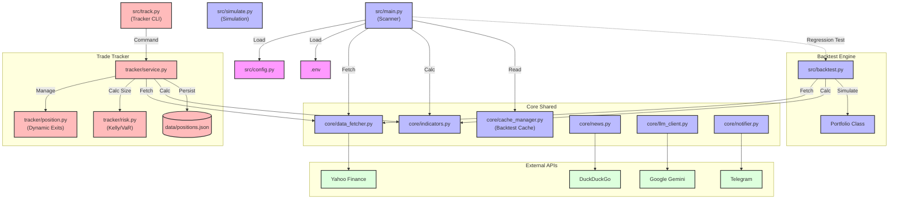
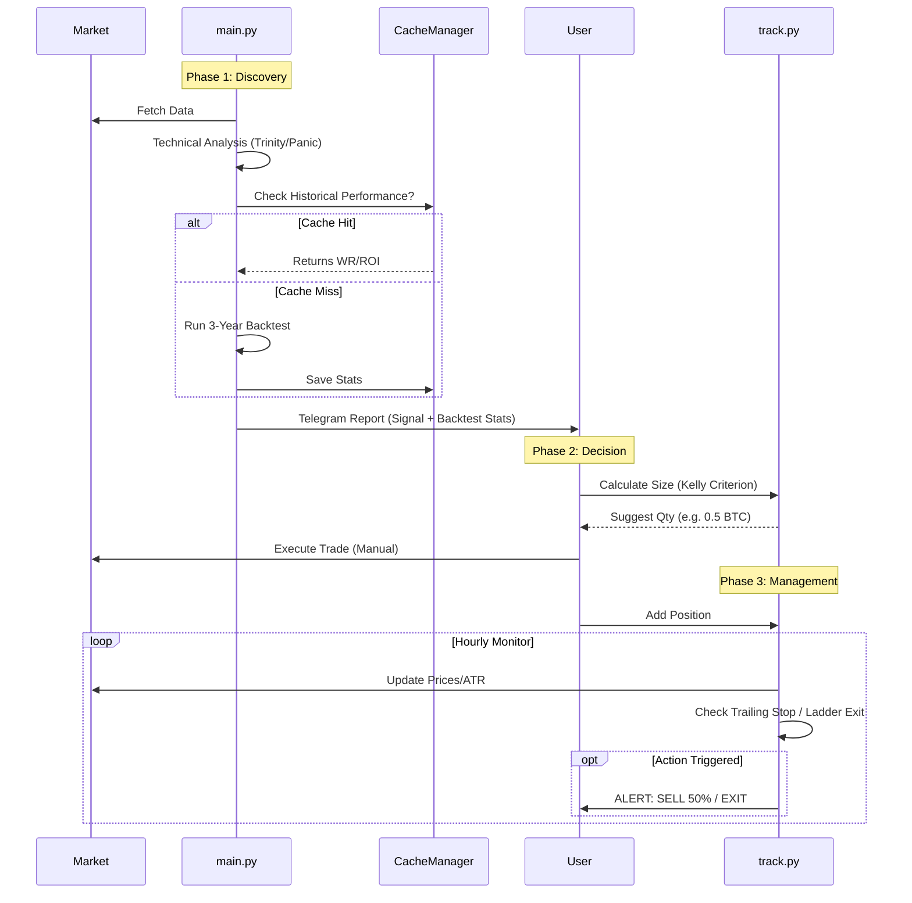

# OpenClaw Financial Intelligence 🦞

**OpenClaw** is a comprehensive, AI-driven financial intelligence system designed to **Scan**, **Verify**, and **Track** high-probability trading setups in US Equities and Cryptocurrencies.

It combines technical analysis algorithms, historical backtesting, and LLM-based intelligence to deliver actionable signals, and provides a dedicated tracker to manage risk during execution.

## 🚀 Key Features

### 1. Intelligent Scanning (`src/main.py`)
*   **Multi-Asset:** Covers US Blue Chips and Top 20 Cryptocurrencies.
*   **Strategies:**
    *   🛡️ **Trinity:** Trend following (Pullback to EMA50 in Uptrend).
    *   🔥 **Panic:** Mean reversion (Oversold RSI < 30 + Below Bollinger Bands).
    *   🔄 **2B Reversal:** Swing failure patterns.
*   **AI Context:** Uses **Google Gemini** to synthesize technicals with recent news (DuckDuckGo).
*   **Regression Testing:** Automatically runs a 3-year backtest on every candidate to verify historical win rates before reporting.

### 2. Paper Trading Engine (`src/simulate.py`)
*   **Time Machine:** Simulates strategies over past 3 years.
*   **Optimization:** Configurable parameter tuning.
*   **Realistic:** Accounts for fractional shares, spread, and short selling.

### 3. Trade Tracker (`src/track.py`)
*   **Risk Management:** Calculates position size using **Kelly Criterion** & **VaR** (Value at Risk).
*   **Dynamic Exits:** Implements **ATR Trailing Stops** to lock in profits.
*   **Ladder Logic:** Automatically suggests scaling out (sell 50%) at TP1.
*   **Tax Estimation:** Estimates tax reserves for short-term gains.

## 🛠️ Installation

1.  **Clone & Install**:
    ```bash
    git clone https://github.com/YOUR_USERNAME/OpenClaw.git
    cd OpenClaw
    pip install -r requirements.txt
    ```

2.  **Configuration**:
    Copy `.env.example` to `.env` and set your keys:
    ```bash
    GEMINI_API_KEY=...
    TELEGRAM_TOKEN=...
    SCAN_MODE=ALL  # US, CRYPTO, or ALL
    ```

## 🏃 Usage Guide

### Mode A: Market Scanner (Discover)
Run the daily scanner to find opportunities:
```bash
python src/main.py
```
*   *Output:* Telegram report with AI insights + Historical Win Rate.

---

### Mode B: Simulation (Verify)
Want to test a strategy on a specific ticker?
```bash
python src/simulate.py --ticker BTC-USD --period 3y
```
*   *Output:* Detailed backtest report including Max Drawdown and Win Rate.

---

### Mode C: Trade Tracker (Manage)
Manage your active positions with professional risk rules.

1.  **Size Your Trade**:
    ```bash
    # "I want to buy BTC at 65k, SL at 63k. Winrate is 60%."
    python src/track.py size BTC-USD 65000 63000 --winrate 60
    ```
    *   *Result:* "Buy 0.3 BTC (Kelly Criterion)"

2.  **Start Tracking**:
    ```bash
    python src/track.py add BTC-USD 65000 0.3 --side LONG --tp1 68000
    ```

3.  **Monitor (Hourly/Daily)**:
    ```bash
    python src/track.py monitor
    ```
    *   *Result:* Updates Trailing Stop, checks TP1, alerts if Exit needed.

## 🏗️ Architecture

## System Overview
OpenClaw is now a comprehensive financial intelligence system comprising three distinct pillars:
1.  **Scanner & Analyst**: Finds opportunities (Scan -> Enrich -> Report).
2.  **Backtest Engine**: Verifies strategies with historical data (Simulate -> Optimize).
3.  **Trade Tracker**: Manages active risk and execution (Sizing -> Monitor -> Exit).

## Component Diagram



## Data Flow: From Signal to Execution



## ⚠️ Disclaimer
**OpenClaw is a research tool.** Not financial advice. Trading involves risk of loss.
